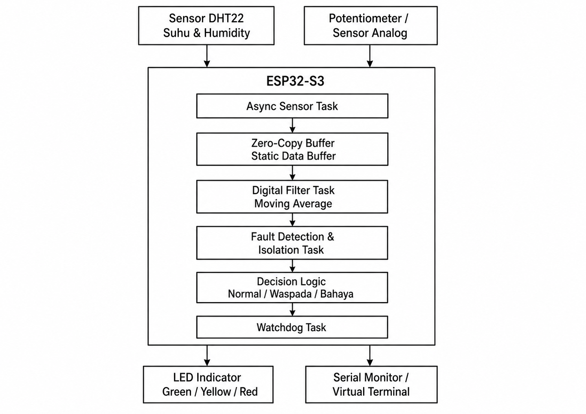
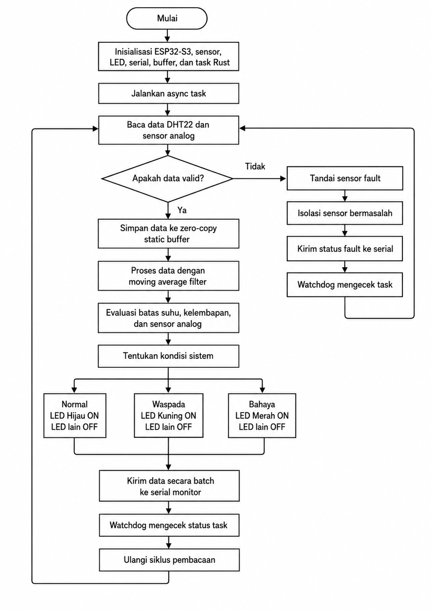
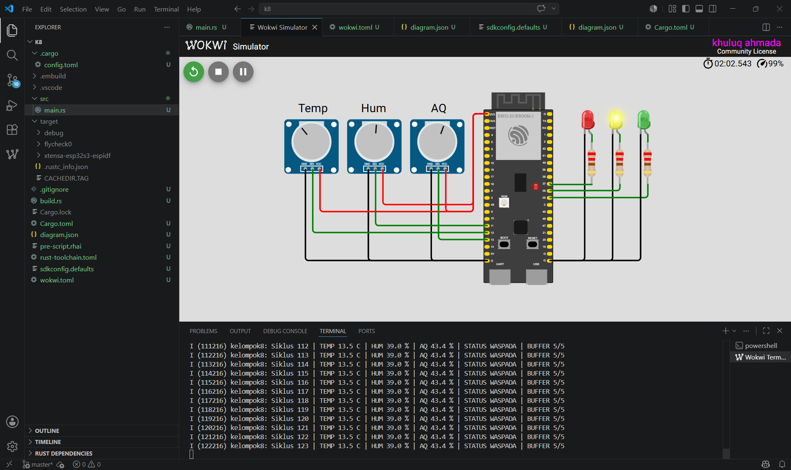

# ESP32-S3 Sensor Monitoring Simulation Using Embedded Rust

## Project Description

This project is a sensor monitoring simulation based on ESP32-S3 using Embedded Rust and Wokwi Simulator. The system is designed to monitor three environmental parameters: temperature, humidity, and air quality. In this simulation, the physical DHT22 sensor is represented by two potentiometers, where one potentiometer is used for temperature and another one is used for humidity. A third potentiometer is used as an analog representation of air quality.

The output of the system is represented by three LEDs. The green LED indicates a normal condition, the yellow LED indicates a warning condition, and the red LED indicates a danger or fault condition. Sensor values and system status are also displayed through the serial monitor.

This project was developed as part of the Embedded Controller Programming midterm assignment. The main focus is to implement a new method for sensor and actuator programming using Rust on ESP32-S3.

## Proposed Method Background

The proposed method is titled:

**Asynchronous Sensor Data Acquisition Method Based on Embedded Rust on ESP32-S3 with Zero-Copy Buffer, Fault Isolation, and Watchdog Task**

This method is developed by integrating several future work directions from previous studies related to embedded systems, microcontroller architecture, Rust programming, sensor data acquisition, fault tolerance, and memory-safe systems.

The method combines the following concepts:

- Asynchronous sensor acquisition logic
- Zero-copy static buffer
- Moving average digital filter
- Fault detection and isolation
- Decision logic for system condition
- Watchdog task concept
- Serial data output for monitoring and GNUPlot analysis

In this simulation, the zero-copy buffer is represented by a static array buffer. Sensor data is stored into this buffer before being processed by the moving average filter. Fault isolation is represented by checking whether the sensor data is valid or not. The watchdog task concept is represented by monitoring the system cycle and task flow through program logic and serial output.

## System Components

The simulation uses the following components:

- ESP32-S3
- 3 Potentiometers
  - Temperature input
  - Humidity input
  - Air quality input
- 3 LEDs
  - Green LED for Normal condition
  - Yellow LED for Warning condition
  - Red LED for Danger or Fault condition
- Resistors for LEDs
- Serial Monitor
- Wokwi Simulator
- Embedded Rust environment

## Pin Configuration

| Component | ESP32-S3 Pin |
|---|---|
| Temperature Potentiometer | GPIO12 |
| Humidity Potentiometer | GPIO11 |
| Air Quality Potentiometer | GPIO13 |
| Red LED | GPIO37 |
| Yellow LED | GPIO36 |
| Green LED | GPIO35 |

## Block Diagram

The block diagram shows the overall structure of the proposed system. Sensor data from the potentiometers is processed by the ESP32-S3 through several logical stages, including sensor acquisition, zero-copy buffer, digital filtering, fault isolation, decision logic, and watchdog task.



## Flowchart

The flowchart describes the algorithm used in the simulation. The system starts by initializing the ESP32-S3, sensor inputs, LED outputs, serial monitor, buffer, and Rust task logic. After initialization, the system continuously reads sensor data, validates the data, stores it into the buffer, applies moving average filtering, evaluates the system condition, updates the LEDs, and sends the result to the serial monitor.



## Simulation Circuit

The simulation circuit was created using Wokwi Simulator. Three potentiometers are used as sensor input sources, and three LEDs are used as system indicators.



## How to Run the Simulation

### 1. Clone the Repository

```bash
git clone https://github.com/ahmada2135/kelompok8_esp32-s3_rust.git
cd kelompok8_esp32-s3_rust
